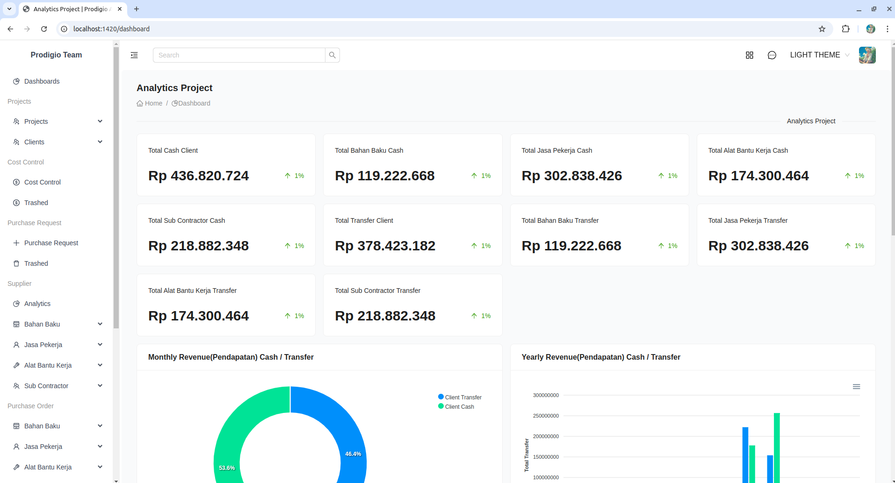
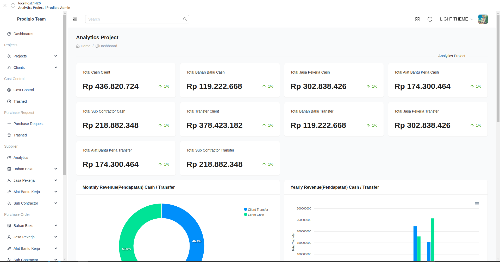
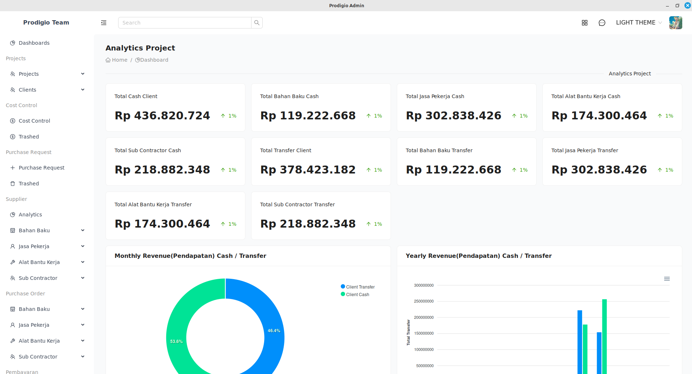

# Prodigio ERP

Prodigio ERP is an innovative Enterprise Resource Planning (ERP) system developed to streamline and manage business processes exclusively within the construction industry. Built with cutting-edge technologies, including Tauri, JavaScript, React, Ant Design (AntD), PHP, and Laravel, this system addresses the unique operational demands of construction management.

Focused on optimizing workflows across project planning, resource allocation, budgeting, and communication, Prodigio ERP provides a robust platform tailored to enhance efficiency and collaboration on construction projects. This project represents a significant step in digital transformation, offering construction firms a powerful tool to support informed decision-making and effective project execution.

## Table of Contents

- [Technologies Used](#technologies-used)
- [Available Themes](#available-themes)
- [Screenshoots](#screenshots)
- [People](#people)

## Technologies Used

- **Tauri**: Used for building the desktop application.
- **JavaScript**: Core language for frontend development.
- **React**: JavaScript library for building user interfaces.
- **Ant Design (AntD)**: UI framework for React.
- **PHP**: Server-side scripting language.
- **Laravel**: PHP framework for building robust backends.

## Available Themes

Below are the themes available for Prodigio ERP:

- Aqua Light Theme
- Aqua Dark Theme
- Gruvbox Light Theme
- Gruvbox Dark Theme
- Night Dark Theme
- Night Light Theme
- Sunset Light Theme
- Sunset Dark Theme
- Light Theme
- Dark Theme

## Screenshoots
- Web Browser

- Progress Web App

- Desktop App

## People

We would like to acknowledge the following individuals for their contributions to Prodigio ERP:

- [Muhammand Wahyu Pratama](https://www.linkedin.com/in/muhamad-wahyu-pratama-4493a1187/) - Project Lead
- [Renaldy Hidayat](https://www.linkedin.com/in/renaldy-hidayat-40033a1b5/) - Full Stack Developer
- [Ridwan Rizqi Ardiansyah](https://www.instagram.com/ridwan.riz/) - Documentation Writer
